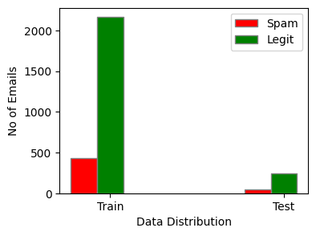

# Spam Filtering using Naive Bayes and SVM

This repository contains a implementation of Naive Bayes classifier and SVM classifier from scratch without using sklearn for implentation.

It contains different types of Naive Bayes Classifier:

* Bernoulli Naive Bayes with Binary Features
* Multinomial Naive Bayes with Binary Features
* Multinomial Naive Bayes with Binary Features

Also Implemented SVM classifer to classify the spam mails.

## Table of Contents

1. [Requirements and Installation](#Requirements-and-Installation)
2. [Dataset](#Data-Distribution)
3. [Feature Selection](#Feature-Selection)
4. [Classifier](#Classifier)
5. [References](#Recommended-Sites-and-Packages)


## Requirements and Installation

```
pip install numpy
pip install scikit-learn
pip install matplotlib
```

## Dataset and Distribution 
Download the ling-spam dataset from this [link](http://www.aueb.gr/users/ion/data/lingspam_public.tar.gz). Used "lingspam_public01" corpus with both lemmatization and stop-word enabled (under the lemm_stop folder) for this project.



## Feature Selection
Feature selection using the information gain (IG) metric. 
### Information Gain/ Mutual Information:

Mutual information is the amount of information that one random variable contains about another. In other words, it’s a measure of their mutual dependence.

The two random variables in the above definition are Term ‘T’ and Class ‘C’, where t ∈ T and c ∈ C {Spam, Legit}. 

$$
I(t\in \{0, 1\}, c \in \{0, 1\}) = \frac{N_{11}}{N}\log_2\frac{NN_{11}}{N_{1*}N_{*1}}+ \frac{N_{01}} {N}\log_2\frac{NN_{01}}{N_{0*}N_{*1}} + \frac{N_{10}}{N}\log_2\frac{NN_{10}}{N_{1*}N_{*0}} + \frac{N_{00}}{N}\log_2\frac{NN_{00}}{N_{0*}N_{*0}} 
$$

- $N_{11}$ is the number of emails that contain the term 't' and belong to class 'spam' 
- $N_{10}$ is the number of emails that contain term 't' but do not belong to class 'spam'
- $N_{01}$ is the count of emails classified as 'spam', where term 't' is absent
- $N_{00}$ is the count of the emails that neither have the term 't' , nor belong to 'spam' 

$$
N_{1*} = N_{10} + N_{11}\\
N_{*1} = N_{01} + N_{11} \\
N_{0*} = N_{01} + N_{00} \\ 
N_{*0} = N_{10} + N_{00}
$$

## Classifier 
### Bernoulli Naive Bayes with Binary Features:

- Let x =($x_1, x_2 ....,x_M$) denote M features for an email X.
- Email can either be {1 - spam, 0 - Legit}
- $x_i$ is either 1 or 0. 0 if the feature is not in the email, 1 if the feature is present.
#### Step - 1: Bayes Rule:

$$
P(spam|x) = \frac{P(x|spam)*P(spam)}{P(x)}
$$
Assuming all term occurences are independent,
$$
P(x_1, x_2, x_3 ...,x_M|spam) = P(x_1|spam)*P(x_2|spam)*.... P(x_M|spam) \\
P(x_1 = 1|spam) = p_{i,s} = \frac{\text{No of Spam emails that contain term i}}{\text{No of Spam emails}}
$$
#### Step - 2: Laplacian Smoothing, find Likelihood/ Conditional probabilities
$$
P(x_1 = 1|spam) = p_{i,s} = \frac{\text{No of Spam emails that contain term i + 1}}{\text{No of Spam emails + 2}}\\
P(x_1 = 0 |spam) = 1 - p_{i,s} \\ 
P(x_1, x_2,...x_M|spam) = \prod_{i=1}^M p_{i,s}^{x_i} (1-p_{i,s})^{1-x_i}
$$

#### Step - 3: Compare P(spam|x) vs P(legit|x):

Applying log to the Bayes theorem, 
$$
\log P(spam|x) = \log P(x|spam) + \log P(spam) - \log P(x) \\
\log P(legit|x) = \log P(x|legit) + \log P(legit) - \log P(x) 
$$


If log P(spam|x) > log P(legit|x) predicted label is spam, else legit. (**Note**: log P(x) cann be ignored, it is present in both the equations)


P(spam|x) > threshold => predicted_output = 1 (spam)

#### Step - 4: Predict Step:

After finding the prior, and likelihood, now we have to find the posterior probabilities for each of the mail in the test dataset. Perform Step3 and determine the output.

### Multinomial Naive Bayes with Binary Features

This is similar to Bernoulli naive bayes except - Multinomial model ignores negative evidence 
- $p_{i, s}$ is estimated differently
- ${x_i}$ = 1 if term i is in mail x, else 0 (Binary Features)
$$
 p_{i,s} = \frac{\text{1 + No of occurences if term i in spam}}{\text{M}+\sum_{i=1}^{M}\text{No of occurences of term i in spam}} \\
 p(x|spam) = D! \prod_{i=1}^{M} p_{i,s}^{x_i}
$$


### Multinomial Naive Bayes with TF

This is similar to Multinomial Naive Bayes with Binary Features except the features now are not binary anymore, they are the term frequencies.
- $x_i$ is the ith term frequency in the mail X

$$
 p_{i,s} = \frac{\text{1 + No of occurences if term i in spam}}{\text{M}+\sum_{i=1}^{M}\text{No of occurences of term i in spam}} \\
 p(x|spam) = D! \prod_{i=1}^{M} p_{i,s}^{x_i}
$$


### SVM Spam Filtering:

#### Methodology: 
- Feature Selection: Using Information Gain/ Mutual Information (same as above) for feature selection. Top 10 features are used as features. CountVectorizer (Term Frequency) will convert tokens to embedddings.

- Now implement the SVM classifier with different kernels and different Hyperparameters. 

**Loss:** 
The Dual Lagrangian loss function which we are trying to maximize is:
$$
L_{dual} = \sum_{}\alpha_i – \frac{1}{2} \sum_{i}\sum_{j} \alpha_i\alpha_j y_i y_j K(x_i, x_j)
$$

**Gradient:**
$$
\frac{\delta L_{dual}}{\delta \alpha_k} = 1 - y_k \sum_{} \alpha_j y_j K(x_j, x_k)
$$

K(xi, xj) is our Kernal function which could be linear, polynomial or gaussian(rbf).

- For Polynomial: $(c + X_1 X_2)^{degree}$
- For Gaussian (RBF): $e^{(-1/\sigma^2)||X_1-X_2||^2}$

**Updates:**
$$
\alpha_k = \alpha_k + \eta \frac{\delta L_{dual}}{\delta \alpha_k}\\
$$


**Prediction:** 
$$
\hat{y} = \text{sign}(\sum_{}\alpha_i y_i k(x_i, x_i) + b)
$$
- Tune the classifier using k-fold cross validation (3 fold). 1 folder is used for testing. Rest of the 9 folders are split into Train and Validation sets ( 6 + 3 = 9). This way, we can find the average precision across different folds. 

- Since, **Precision** is an important metric in case of spam filtering. We want the hyperparameters combination that has maximum precision.


See the included Jupyter Notebook (`Spam_Filtering.ipynb`) for the implementation.For only 10 extracted features, SVM classifier has a precision of 0.75 on test dataset and an accuracy of 0.84 on test dataset

## References
* [Mutual Information Calculation](https://nlp.stanford.edu/IR-book/html/htmledition/mutual-information-1.html) 

* [Kernel SVM](https://www.adeveloperdiary.com/data-science/machine-learning/support-vector-machines-for-beginners-kernel-svm/)

* [Training Algorithm SVM](https://www.adeveloperdiary.com/data-science/machine-learning/support-vector-machines-for-beginners-training-algorithms/)